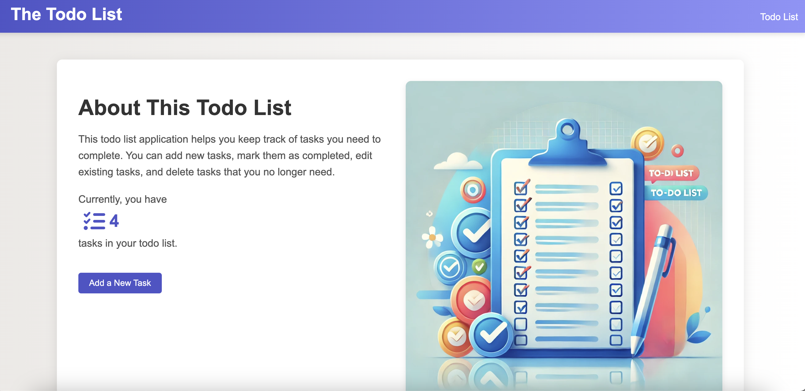
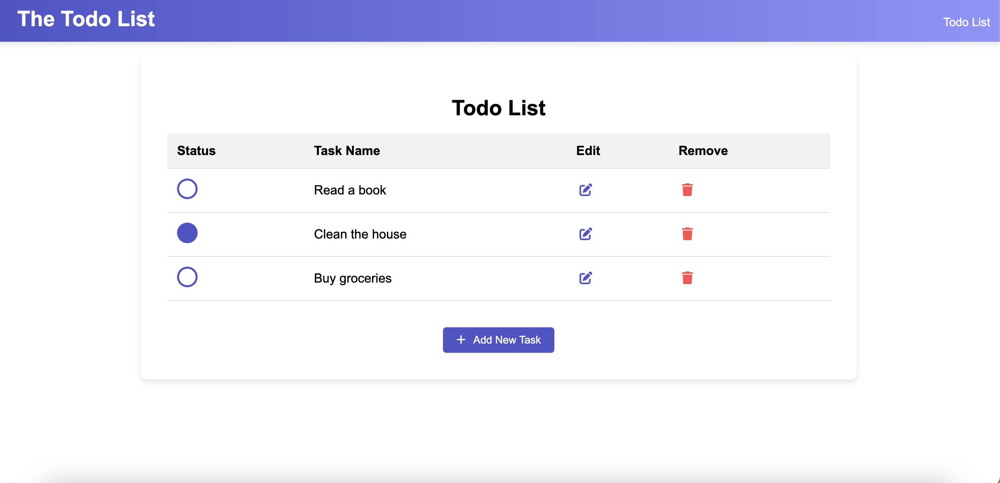

# Todo List Application




## Overview

This is a simple and modern Todo List application built with React and TypeScript. The app allows users to manage their tasks effectively by adding, editing, completing, and removing tasks. It also includes an "About" page that gives an overview of the application and displays the current number of tasks.

## Features

- **Add Tasks:** Users can add new tasks to their todo list.
- **Edit Tasks:** Existing tasks can be edited.
- **Complete Tasks:** Tasks can be marked as complete, which visually updates the status indicator.
- **Delete Tasks:** Tasks that are no longer needed can be removed from the list.
- **About Page:** Provides information about the application and displays the current number of tasks.
- **Responsive Design:** The application is fully responsive and works well on various devices.

## Installation

To run this application locally, follow these steps:

1. **Clone the repository:**

   ```bash
   git clone https://github.com/your-username/todo-list-app.git
   cd todo-list-app